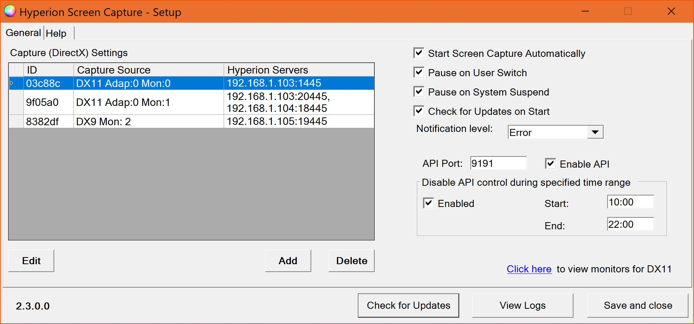
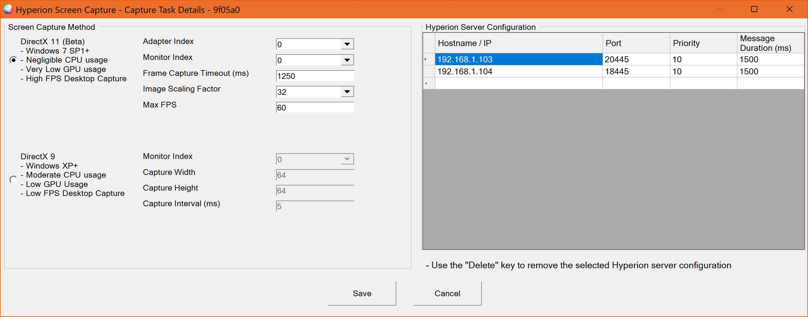
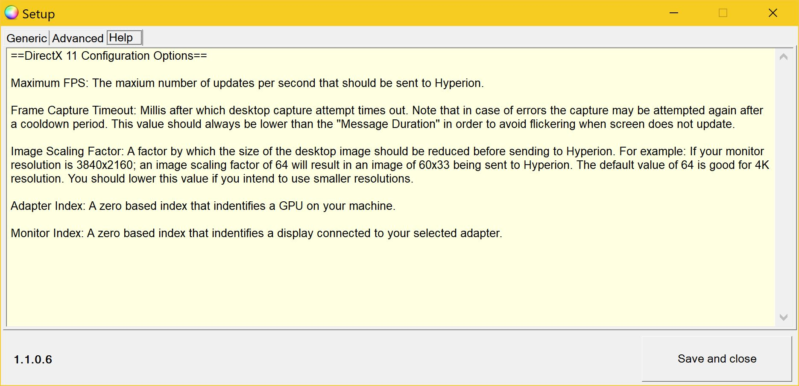

# Hyperion Screen Capture (Windows Grabber)

Windows screen capture program for the [Hyperion](https://github.com/tvdzwan/hyperion) open-source Ambilight project.

The program uses DirectX 9/11 to capture the screen, resize it and send it to the ProtoBuffer interface of Hyperion.

**Changelog and official forum thread:** https://hyperion-project.org/threads/1018

## Dependencies

**The following dependencies need to be installed manually**

[Microsoft DotNet 4.0](https://www.microsoft.com/en-us/download/details.aspx?id=17718)

[DirectX End-User Runtime](https://www.microsoft.com/en-us/download/details.aspx?displaylang=en&id=35)

**If screen capture is not working, install the following dependencies as well**

[Visual C++ Redistributable for Visual Studio 2012](https://www.microsoft.com/en-us/download/details.aspx?id=30679)

[Microsoft Visual C++ 2010 Service Pack 1](https://www.microsoft.com/en-us/download/details.aspx?id=26999)

[Microsoft Visual C++ 2008 Service Pack 1](https://www.microsoft.com/en-us/download/details.aspx?id=26368)

## Download

[SetupHyperionScreenCapture.exe](https://github.com/sabaatworld/HyperionScreenCap/releases)

## Configuration

The application can be configured using the setup window which can be accessed by right clicking on the system tray icon. The defaults for most of the settings should work out of the box.
Description of the configuration parameters can be found on the help tab of the setup window.

## Setup Window

### Manage screen capture configurations and other application level settings.

### Select between DirectX11 & DirectX9 capture methods and define one or more Hyperion server destinations.

### Use the help tab to understand how to configure screen captures.

## DirectX11 4K @ 60Hz HDR Demo

## Credits

Icons made by [mynamepong](https://www.flaticon.com/authors/mynamepong), [Good Ware](https://www.flaticon.com/authors/good-ware), [Freepik](https://www.flaticon.com/authors/freepik)
and [Kiranshastry](https://www.flaticon.com/authors/kiranshastry) from [www.flaticon.com](https://www.flaticon.com/)
